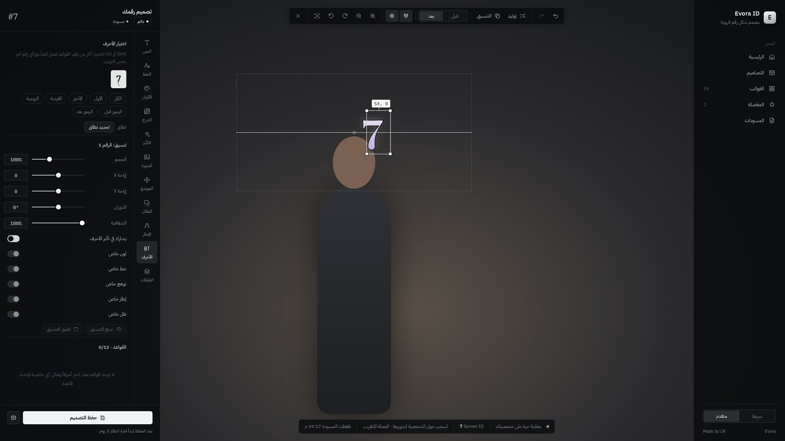
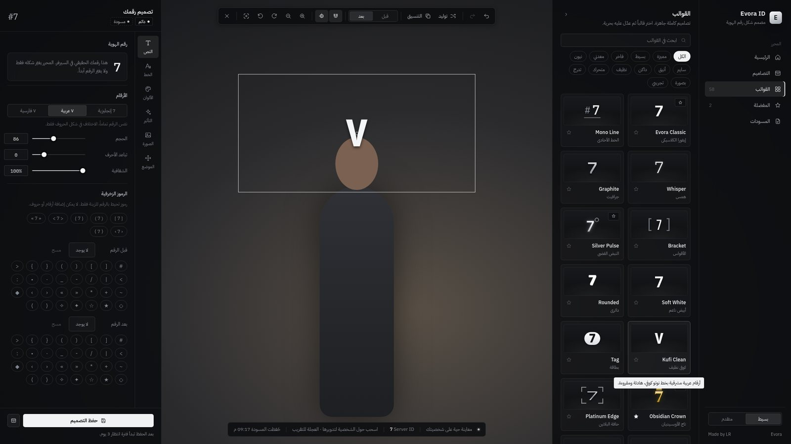
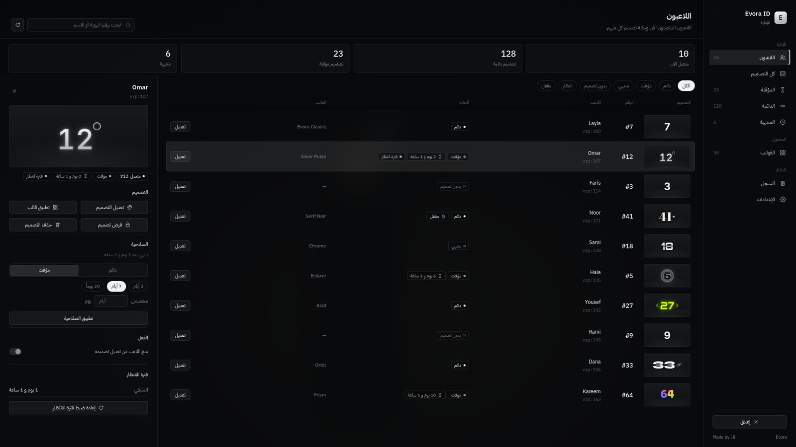
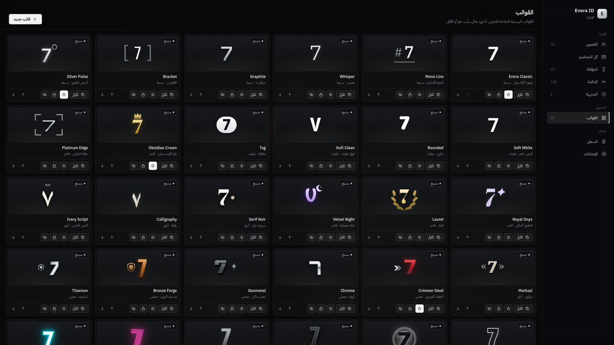

# Evora ID — `Evora_idv1`

**Evora ID changes how a player's FiveM server ID looks. It never changes what the ID is.**

If FiveM gives a player server ID `7`, everybody still sees `7` above that player's head. Evora ID changes only how that `7` is drawn: its typography, gradients, outlines, glow, one image and one animation. The ID is never replaced, regenerated or renumbered. The resource does not touch the vRP user id or any identifier, and it has no identity system of its own. Every design is only a *description of the look*. The number itself always comes from the player's live server ID at render time.

> تغيير شكل رقم الهوية فقط — الرقم الحقيقي لا يتغير أبداً.

Brand: **Evora** · Author: **Made by LR** · Framework: Universal vRP (plus a standalone fallback) · Database: oxmysql · UI: Arabic, RTL

---

## Contents

1. [Features](#features)
2. [Requirements](#requirements)
3. [Installation](#installation)
4. [Permissions](#permissions)
5. [Commands & BuilderMenu](#commands--buildermenu)
6. [vRP compatibility](#vrp-compatibility)
7. [Configuration](#configuration)
8. [How rendering works](#how-rendering-works)
9. [The editor](#the-editor)
10. [Management](#management)
11. [Cooldown](#cooldown)
12. [Temporary & permanent designs](#temporary--permanent-designs)
13. [Images](#images)
14. [Presets](#presets)
15. [Effects](#effects)
16. [Fonts](#fonts)
17. [Database](#database)
18. [Audit webhook](#audit-webhook)
19. [Developer API](#developer-api)
20. [Design format & migration](#design-format--migration)
21. [Security model](#security-model)
22. [Performance](#performance)
23. [Troubleshooting](#troubleshooting)
24. [Testing](#testing)

---

## Features

- **Live preview on your real character.** A scripted camera frames your actual ped, and your draft design is drawn above your real head. It uses the same pipeline that draws everyone else's ID, so what you see is what other players will see.
- **Direct manipulation.** Drag, scale and rotate the text, the image, the group or the whole composition straight over the in-game render. Alignment guides, snap with adjustable sensitivity, and numeric X / Y / scale / rotation fields are all included.
- **Text system.** 66 open-licence fonts (Arabic and Latin), weight, italic, size, letter spacing, line height, alignment and opacity. You can pick Western, Arabic-Indic or Persian numerals (the same number with different glyphs) and add decorative symbols around the number. Symbols are never digits or letters.
- **Fills.** Solid colour, or a linear, radial or conic gradient with up to 6 stops. One gradient can span the whole number, or each character can get its own.
- **Outline, shadow and glow** on the number, all independently configurable.
- **Character editor.** Select one character, several, a range, first/last/odd/even, or the decorative symbols. Then give that selection its own colour, gradient, font, weight, size, offset, rotation, opacity, glow, outline or shadow, and choose whether it takes part in the letter effects. Copy and paste character styles.
- **One image.** Pick a bundled emblem (tintable with any fill), a direct HTTPS image URL, or a Discord user's avatar resolved securely on the server. Controls cover size (with ratio lock), fit, radius, opacity, border, glow, shadow, front/back order, auto-width backgrounds and attaching to a side of the number so the image never overlaps it, however many digits the ID has. Animated GIFs play.
- **One effect.** 24 effect types plus a custom keyframe effect, and 25 reusable effect presets. Simple mode offers speed and intensity. Advanced mode adds a **timeline** with delay, duration, repeats, ping-pong, easing, direction, letter stagger and keyframes.
- **58 complete presets** in 12 categories. Each one is a full visual identity (font, fill, outline, shadow, glow, character rules, image, effect and layout), not a colour swap.
- **Randomize** builds a coherent design from a mood, a matching palette, a font and an effect. You can generate again, apply, or discard it.
- **Before / After** comparison on the live character.
- **Undo / Redo** covers text, characters, image, transforms, gradients, effects, presets, randomize and layers.
- **Copy / Paste style** for the number, the image, characters, or the complete design.
- **Layer groups.** Group the text and image, then move, scale, rotate or reset them together. Ungrouping bakes the transform back into each layer.
- **Favourites** (stored on the server), **Recent designs** and **auto-saved drafts** (stored on the player's own machine), plus **3 design slots** (configurable).
- **Simple / Advanced** editing modes.
- **Management.** Online players and stored designs, search, filters (All / Permanent / Temporary / Expired / No design / Cooldown / Locked), status badges, live previews, apply or force presets, edit, delete, change expiry, reset cooldown and lock designs. It also includes the **preset creator**, an audit page and a settings summary.
- **Audit log** to the database and an optional Discord webhook, fully server-side.
- **Developer API**: server and client exports plus server events.
- Exactly **three permissions**, universal vRP adapters, oxmysql, and parameterized SQL everywhere.

### Screenshots

These were captured by the automated browser harness (`tests/ui.mjs`), so the centre shows a stand-in silhouette. In game it shows your real character, and the ID above it is drawn by the in-game DUI renderer.

| Editor: drag, snap and guides on the live ID | Editor: presets gallery |
|---|---|
|  |  |
| **Management: players and details** | **Management: preset admin** |
|  |  |

Every built-in preset, rendered through the actual DUI page (`html/render.html`) with example IDs: [images/presets.jpg](images/presets.jpg)

---

## Requirements

| Dependency | Notes |
|---|---|
| FiveM server (recent artifact) | `lua54`, DUI, runtime textures |
| [oxmysql](https://github.com/overextended/oxmysql) | Detected at runtime. Without it IDs still render, but saving is disabled. |
| vRP (any flavour) | Optional. Without it the resource runs in **standalone** mode (ACE permissions + Rockstar license). |

No other resources are required. Fonts, emblems and every UI asset ship inside the resource.

---

## Installation

1. Copy the `Evora_idv1` folder into your `resources` directory. **Keep the folder name**: the exports are documented as `exports['Evora_idv1']`.
2. Add it to `server.cfg` **after** oxmysql and vRP:

   ```cfg
   ensure oxmysql
   ensure vrp
   ensure Evora_idv1
   ```

3. Give out the permissions (see [Permissions](#permissions)).
4. Optional secrets, set in `server.cfg` and never in `config.lua`:

   ```cfg
   set evora_id_webhook "https://discord.com/api/webhooks/…"      # audit log
   set evora_discord_bot_token "YOUR_BOT_TOKEN"                      # Discord avatars
   ```

5. Start the server. Tables are created automatically (`Config.Database.AutoSchema`). If your database user cannot create tables, run `sql/install.sql` once by hand.
6. **Disable any other script that draws player IDs above heads.** Evora ID draws every player's ID: custom designs, and the default look for everyone else.

---

## Permissions

There are exactly three permissions:

| Permission | Grants |
|---|---|
| `evora.idname.self` | Open the editor, edit/save **your own** design, use presets, randomize, favourites, drafts, slots. |
| `evora.idname.manage` | Everything in management: edit/delete anyone's design, apply/force presets, change expiration, reset cooldowns, lock designs, create/edit/delete/reorder presets, audit. |
| `evora.idname.bypass` | Skip the self-editing cooldown, **only when the player also has `evora.idname.self`**. On its own it grants nothing and cannot open the editor. |

Seeing IDs needs **no** permission. Everybody sees everybody's ID.

**vRP 1 / vRPex** (`vrp/cfg/groups.lua`):

```lua
["user"] = {
  "evora.idname.self",
},
["vip"] = {
  "evora.idname.self",
  "evora.idname.bypass",
},
["admin"] = {
  "evora.idname.manage",
},
```

**ACE / standalone** (also accepted alongside vRP when `Config.Permissions.AceFallback = true`):

```cfg
add_ace builtin.everyone evora.idname.self allow
add_ace group.admin evora.idname.manage allow
add_ace group.admin evora.idname.bypass allow
```

**Creative and other group-based forks.** Map our names to yours in `Config.Permissions.Map`:

```lua
Config.Permissions.Map = {
    ['evora.idname.manage'] = 'Admin',
    ['evora.idname.self']   = 'Premium',
}
```

Permission checks are always made on the server and cached for `Config.Permissions.CacheSeconds` seconds.

---

## Commands & BuilderMenu

| Command | Default | Who |
|---|---|---|
| Editor | `/idname` | `evora.idname.self` |
| Management | `/idnamemanager` | `evora.idname.manage` |

Command names live in `Config.Commands`. `Config.Commands.EditorKey` optionally binds the editor to a key (players can rebind it under *Settings → Key Bindings → FiveM*).

**BuilderMenu.** When a vRP flavour with a menu builder is detected, two entries are registered:

```lua
Config.BuilderMenu = {
    Enabled = true,
    Parent = 'main',          -- builder the self entry is added to (e.g. 'BuilderMenu')
    ManageParent = 'admin',   -- builder for the management entry (nil = Parent)
    SelfLabel = 'Evora ID',
    ManageLabel = 'Evora ID — الإدارة',
}
```

The self entry appears only for players with `evora.idname.self`, and the management entry only for `evora.idname.manage`. The server checks permissions again when the entry is used.

Other resources can open the UI from the server with `TriggerEvent('Evora_idv1:openEditor', src)` and `TriggerEvent('Evora_idv1:openManager', src)`. Permissions are still enforced.

---

## vRP compatibility

All framework access goes through **one adapter** (`framework/adapter.lua`). The rest of the resource never calls vRP directly.

| Adapter | Detected by | API used |
|---|---|---|
| `vrp2` | `lib/Luaoop.lua` (vRP 2) | loads `framework/vrp/vrp2_ext.lua` into vRP with `vRP.loadScript`, `user:hasPermission`, `vRP.EXT.GUI:registerMenuBuilder` |
| `vrp_creative` | `vRP.Passport` / `vRP.HasPermission` in vRP sources | `Passport`, `HasPermission` / `HasGroup`, `Identity` |
| `vrp_legacy` | Dunko-style proxy (`function(args, callback)`) | `getUserId({src})`, `hasPermission({id, perm})`, `registerMenuBuilder({name, fn})` |
| `vrp_modern` | standard vRP 1.x / vRPex proxy | `getUserId(src)`, `hasPermission(id, perm)`, `registerMenuBuilder(name, fn)` |
| `standalone` | fallback | ACE permissions, Rockstar `license:` identifier |

- `Config.Framework.Adapter = 'auto'` detects the flavour. Force one by name if you need to.
- `Config.Framework.ResourceName` names your vRP resource (default `vrp`).
- vRP's Proxy library is loaded at runtime (no `@vrp/lib/utils.lua` include), so a missing or renamed vRP never stops the resource from starting.
- Designs are keyed by the **account** (`vrp:<user_id>` or `license:<hash>`), so a design follows the player across sessions. The number drawn is always their **current server ID**.

Adding another framework means writing one file that implements `init`, `getUserId`, `hasPermission`, `getName` and optionally `registerMenus`, registered as `EvoraAdapters.<name>`.

---

## Configuration

Everything configurable lives in `config/config.lua` (shared) and `config/fonts.lua` (font registry). You never need to edit the core files.

| Section | What it controls |
|---|---|
| `Config.Debug` | Verbose console output. |
| `Config.Framework` | Adapter (`auto` / name), vRP resource name, start timeout. |
| `Config.Database` | oxmysql resource name, auto schema, purge of long-expired designs, audit retention. |
| `Config.Permissions` | The three permission names, ACE fallback, cache seconds, name mapping. |
| `Config.Commands` | Command names, optional editor key. |
| `Config.BuilderMenu` | vRP menu entries and their parent builders. |
| `Config.Cooldown` | Enable, seconds between self saves (default 3 days), manager exemption. |
| `Config.Temporary` | Offered durations, default and maximum duration, whether self edits keep the expiry, in-memory check interval. |
| `Config.Slots` / `Config.Favorites` | Saved design slots per player, favourites limit. |
| `Config.DefaultPreset` | Look for players without a design (a preset id, or `false` for native text). |
| `Config.Render` | Display mode (`always` / `hold` / `toggle` + key), max distance, fade start, height offset, own ID, line of sight, hide in vehicles, world size of the stage, scale, distance scaling and clamps, atlas size, scan interval. |
| `Config.Editor` | Camera distance / height / FOV / zoom limits, vehicle block, default snap sensitivity. |
| `Config.Images` | Enable, URL / Discord toggles, host allow-list, extensions, GIF, max bytes, URL length, validation cache, Discord token convar, avatar size, refresh interval. |
| `Config.Webhook` | Enable, URL convar, username, colour, which actions are sent. |
| `Config.Management` | Allow "force style", page size. |
| `Config.Security` | Rate-limit window and budgets, rejection logging. |
| `Config.Notify` | Client notification function (replace to use your own notify system). |

---

## How rendering works

The overhead ID is drawn with a **DUI atlas and UV-mapped sprites**:

1. One off-screen browser (DUI) renders every visible design into a grid of 512×256 slots (`html/render.html`). Chromium handles fonts, Arabic shaping, gradients, filters, CSS animations, SVG emblems and animated GIFs.
2. The DUI is exposed as a runtime texture. Each frame, each visible player gets **one** `DrawSpriteUv` call at their head (`SetDrawOrigin`), sized with real perspective from the camera's field of view and clamped to readable limits.
3. A slow scan (`Config.Render.ScanInterval`, 250 ms by default) decides who is visible (distance, line of sight, visibility) and assigns slots nearest-first. The DUI receives a message **only when a slot's content changes**. Nothing is sent per frame.
4. Players beyond the atlas capacity (`AtlasColumns × AtlasRows`, 16 by default), or everyone if the DUI is unavailable, fall back to native text, so an ID is always shown.

The editor's live preview uses this exact pipeline for your own ped, which is why the preview is exact.

Why not the alternatives? `DrawText` cannot do custom Arabic fonts, gradients or images. A full-screen NUI overlay needs position messages every frame. One DUI per player costs one browser each. The atlas gives full visual quality with a single browser and one draw call per ID.

---

## The editor

- **Start** it with `/idname` (or the BuilderMenu). The camera frames your character, your real server ID is shown, and the presets gallery opens.
- **Left column** (the end side in RTL): contextual inspector with tabs. Simple mode shows Text, Font, Colours, Effect, Image and Position. Advanced mode adds Gradient, Shadows, Outline, Characters and Layers, plus the timeline.
- **Right column** (the start side): navigation with Home, Designs (slots + recent), Presets, Favourites and Drafts.
- **Centre**: the game itself. Drag elements, drag empty space to turn your character, and use the mouse wheel to zoom.
- **Toolbar**: undo/redo, randomize, copy/paste style, before/after, snap, guides and camera controls.
- **Keyboard**: `Ctrl+Z` / `Ctrl+Y`, arrow keys nudge the selection (hold Shift for ×10), `Ctrl+S` saves, `Esc` closes.

Everything is **local preview** until **Save**. Nothing on the server changes until then, and closing without saving never starts a cooldown. Unsaved work is auto-saved as a **draft** on the player's machine and offered again next time ("Continue draft / Discard"). Drafts never become active by themselves.

**Slots** keep up to `Config.Slots.Count` saved designs per player. Saving to a slot does not apply the design and does not start the cooldown. Loading a slot and pressing Save applies it.

---

## Management

`/idnamemanager` opens a separate interface:

- **Players**: every online player with a live thumbnail of their real ID, status badges and filters (All / Permanent / Temporary / Expired / No design / Cooldown / Locked). You can search by server ID or name. Live names are used, never stale database values.
- **All designs / Temporary / Permanent / Expired**: stored designs for online *and* offline accounts, with paging and search by name or account.
- **Details panel**: live preview, edit design (opens the live editor on your own character with the target's real number), apply a preset, force a style (apply + lock), delete, change expiration (permanent, or temporary with 3/7/30 days or a custom duration), lock/unlock, reset cooldown.
- **Presets**: create (in the full editor), edit, duplicate, delete (custom only), feature, lock (managers only), hide from players, reorder.
- **Audit**: the latest administrative actions.
- **Settings**: a read-only summary of the active configuration.

---

## Cooldown

- The cooldown is enforced on the server. `Config.Cooldown.Seconds` defaults to 3 days.
- It **starts only after a successful final save**. Opening the editor, changing values, previewing, comparing, randomizing, saving to a slot or closing without saving never start it. A failed save (invalid design, rejected image, database error) does not start it either.
- `self` + `bypass` skips it. Managers are exempt when `Config.Cooldown.ManagersExempt = true`.
- Managers can reset any player's cooldown.

---

## Temporary & permanent designs

- Managers choose **permanent** (no expiry) or **temporary** (3 days, 7 days, 30 days or custom, up to `Config.Temporary.MaxSeconds`). The server computes the expiry itself and never trusts a client timestamp.
- There is **no database polling**. Expiry is checked when a player loads, and every `Config.Temporary.CheckInterval` seconds against the in-memory records of online players only. When a design expires it stops showing immediately and `Evora_idv1:designExpired` fires.
- Expired designs stay visible under the **Expired** filter so managers can extend them or make them permanent. `Config.Database.PurgeExpiredAfterDays` clears them after the given number of days (one statement at start-up).
- `Config.Temporary.SelfEditKeepsExpiry`: when a player edits a temporary design, it keeps its expiry (`true`) or becomes permanent (`false`).

---

## Images

Each design holds **at most one image**. The single image slot is part of the data format, so a second image cannot exist.

| Source | How |
|---|---|
| Emblem | 22 bundled SVG emblems and shapes (pill, plate, frame, line…). They can be tinted with any fill and never depend on the internet. |
| Direct URL | HTTPS only. The host must be in `Config.Images.AllowedHosts` (Discord CDN, Imgur, ImgBB, …) unless `AllowAnyHost = true`. |
| Discord user ID | The server calls the Discord API with the bot token from the `evora_discord_bot_token` convar and builds the avatar URL. The token never reaches clients. Without a token, the Discord default avatar is used. |

Validation happens on the server for every save and for the editor's "check" button:

1. Structural URL check (HTTPS, length, no characters that could break out of CSS).
2. Host allow-list and extension allow-list (PNG, JPG, WEBP, GIF).
3. A real request (`HEAD`, falling back to a 32-byte ranged `GET`) that confirms an image content type or image magic bytes and the size limit (`MaxBytes`).
4. The result is cached (`CacheSeconds`), so the same URL is not checked again and again.

In the editor, the image is also loaded locally first so you get an instant preview and a clear error. If a saved image later becomes unavailable, it is hidden ("Image unavailable") and the number keeps rendering normally. Discord avatars are refreshed after `RefreshHours`.

> Discord *attachment* links expire. For permanent images, prefer an avatar (Discord user ID) or a permanent host.

---

## Presets

58 built-in presets in 12 categories (Minimal, Premium, Metallic, Neon, Cyber, Elegant, Dark, Clean, Animated, Gradient, Image Based, Experimental). Each is a complete design.

**Adding built-in presets.** Create a file in `presets/` (loaded automatically, in alphabetical order) and use the helpers:

```lua
local H = EvoraPresets.H
EvoraPresets.define({
    id = 'my-preset', category = 'premium', name = 'My Preset', nameAr = 'قالبي',
    description = 'وصف قصير',
    design = {
        text = {
            font = 'cinzel', weight = 800, size = 84,
            fill = H.linear(180, '#F9E9B8', '#D4AF37', '#8C6A1C'),
            outline = H.outline(2, '#1A1406'),
            glow = H.glow('#D4AF37', 16, 0.3),
        },
        image = H.emblem('crown', { w = 38, attach = 'top', gap = -8, tint = H.solid('#F9E9B8') }),
        effect = H.fx('fx-slow-shine'),
    },
})
```

Anything you leave out takes the schema default. Presets are validated with the same sanitizer as player designs.

**In-game preset creator.** Management → Presets → *New preset* opens the full editor. Saving asks for a name, description, category and flags. Managers can also flag built-in presets as featured, locked or hidden and reorder the gallery. These overrides are stored in the database.

- **Featured**: highlighted in the gallery.
- **Locked**: visible, but only managers can apply it. A player's save is refused if its design matches a locked preset.
- **Hidden**: not shown to players.

### Built-in presets

| Preset | Arabic | Category | Effect | Image |
|---|---|---|---|---|
| Evora Classic (`evora-classic`) | إيفورا الكلاسيكي | minimal | none | — |
| Mono Line (`mono-line`) | الخط الأحادي | minimal | none | line |
| Whisper (`whisper`) | همس | minimal | fade | — |
| Graphite (`graphite`) | جرافيت | minimal | none | — |
| Bracket (`bracket`) | الأقواس | minimal | none | — |
| Silver Pulse (`silver-pulse`) | النبض الفضي | minimal | breathe | ring |
| Soft White (`soft-white`) | أبيض ناعم | clean | none | — |
| Rounded (`rounded`) | دائري | clean | none | — |
| Kufi Clean (`kufi-clean`) | كوفي نظيف | clean | none | — |
| Tag (`tag`) | بطاقة | clean | none | pill |
| Obsidian Crown (`obsidian-crown`) | تاج الأوبسيديان | premium | shine-sweep | crown |
| Platinum Edge (`platinum-edge`) | حافة البلاتين | premium | light-sweep | frame |
| Royal Onyx (`royal-onyx`) | العقيق الملكي | premium | soft-glow | — |
| Laurel (`laurel`) | الغار | premium | shimmer | laurel |
| Velvet Night (`velvet-night`) | ليلة مخملية | premium | breathe | crescent |
| Serif Noir (`serif-noir`) | سيريف نوار | elegant | none | — |
| Calligraphy (`calligraphy`) | رقعة | elegant | float | — |
| Ivory Script (`ivory-script`) | النص العاجي | elegant | soft-glow | halo |
| Markazi (`markazi`) | مركزي | elegant | fade | — |
| Crimson Steel (`crimson-steel`) | الفولاذ القرمزي | metallic | shine-sweep | chevron |
| Chrome (`chrome`) | كروم | metallic | shine-sweep | — |
| Gunmetal (`gunmetal`) | معدن داكن | metallic | none | bolt |
| Bronze Forge (`bronze-forge`) | مسبك البرونز | metallic | shimmer | shield |
| Titanium (`titanium`) | تيتانيوم | metallic | light-sweep | hex |
| Void (`void`) | الفراغ | dark | none | — |
| Eclipse (`eclipse`) | الكسوف | dark | breathe | ring |
| Shadowline (`shadowline`) | خط الظل | dark | none | line |
| Smoke (`smoke`) | دخان | dark | blur-pulse | — |
| Neon Pulse (`neon-pulse`) | نبض النيون | neon | flicker | — |
| Cyan Tube (`cyan-tube`) | أنبوب سماوي | neon | soft-glow | — |
| Acid (`acid`) | حمضي | neon | pulse | — |
| Vapor (`vapor`) | فيبر | neon | gradient-flow | — |
| Circuit (`circuit`) | دارة | cyber | digital-glitch | — |
| Glitchcore (`glitchcore`) | جلتش | cyber | glitch | — |
| Terminal (`terminal`) | الطرفية | cyber | letter-flicker | — |
| Hologram (`hologram`) | هولوغرام | cyber | rgb-shift | — |
| Grid Runner (`grid-runner`) | عدّاء الشبكة | cyber | light-sweep | triangle |
| Heartbeat (`heartbeat`) | نبضة | animated | scale-pulse | — |
| Wave Rider (`wave-rider`) | راكب الموج | animated | letter-wave | — |
| Bounce (`bounce`) | قفز | animated | letter-bounce | — |
| Orbit (`orbit`) | مدار | animated | rotation | orbit |
| Drift (`drift`) | انجراف | animated | letter-float | — |
| Sunset Strip (`sunset-strip`) | شريط الغروب | gradient | color-shift | — |
| Aurora (`aurora`) | الشفق | gradient | gradient-flow | — |
| Ocean Depth (`ocean-depth`) | عمق المحيط | gradient | none | spark |
| Prism (`prism`) | منشور | gradient | color-shift | — |
| Rose Quartz (`rose-quartz`) | كوارتز وردي | gradient | none | — |
| Winged (`winged`) | المجنّح | image | float | wings |
| Shielded (`shielded`) | الدرع | image | light-sweep | shield |
| Diamond Cut (`diamond-cut`) | قطع الماس | image | none | diamond |
| Ember (`ember`) | جمرة | image | soft-glow | flame |
| Star Mark (`star-mark`) | علامة النجمة | image | pulse | star4 |
| Plated (`plated`) | اللوحة | image | none | plate |
| Pixel (`pixel`) | بكسل | experimental | letter-bounce | — |
| Blackletter (`blackletter`) | القوطي | experimental | none | — |
| Split Tone (`split-tone`) | ثنائي اللون | experimental | letter-wave | — |
| Tilted (`tilted`) | المائل | experimental | wave | — |
| Hollow (`hollow`) | المجوّف | experimental | shimmer | — |

---

## Effects

A design has **one effect object**, so only one effect can be active at a time. This keeps the ID readable and the renderer light. Choosing another effect replaces the current one.

Every effect has: `target` (text / image / all), `duration`, `delay`, `speed`, `intensity`, `direction`, `loop` / `iterations`, `pingpong`, `easing` (`linear`, `ease`, `ease-in`, `ease-out`, `ease-in-out`, `smooth`, `sharp`, `back`, `steps`), `stagger` (letter effects) and `color` (glow and sweep effects). The `keyframes` type animates opacity, scale, x, y, rotation, glow and blur across up to 8 keyframes on the timeline.

Letter effects move each character in sequence. A character rule can opt a character out (`animate = false`). The *Terminal* preset uses this to blink only its cursor.

| Type | Arabic | Scope |
|---|---|---|
| `none` | بدون تأثير | any |
| `soft-glow` | توهج ناعم | any |
| `pulse` | نبض | any |
| `breathe` | تنفس | any |
| `wave` | تموج | any |
| `float` | طفو | any |
| `shimmer` | بريق | any |
| `flicker` | وميض | any |
| `rgb-shift` | إزاحة لونية | any |
| `rainbow` | قوس قزح | any |
| `gradient-flow` | تدفق التدرج | text |
| `color-shift` | تحول لوني | any |
| `glitch` | تشويش | any |
| `digital-glitch` | تشويش رقمي | any |
| `shine-sweep` | لمعة عابرة | any |
| `light-sweep` | مسح ضوئي | any |
| `fade` | تلاشي | any |
| `scale-pulse` | نبض الحجم | any |
| `rotation` | دوران | any |
| `blur-pulse` | نبض ضبابي | any |
| `letter-wave` | موجة الأحرف | text |
| `letter-bounce` | قفز الأحرف | text |
| `letter-float` | طفو الأحرف | text |
| `letter-flicker` | وميض الأحرف | text |
| `keyframes` | مخطط زمني مخصص | any |

Effect presets (`shared/effects.lua` → `EvoraEffects.Presets`) are named parameter sets such as *Slow Shine*, *Heartbeat* or *Neon Flicker*. Add your own there.

---

## Fonts

66 families plus a symbol fallback, all under the **SIL Open Font License 1.1** (see `html/fonts/LICENSES.md`). The shipped files are subsets that contain only what an overhead ID can display (digits in three numeral systems and the decorative symbols), so the whole set weighs well under 1 MB. The UI uses IBM Plex Sans Arabic / IBM Plex Mono.

**Adding a font:** put the `.woff2` / `.ttf` / `.otf` file in `html/fonts/id/`, then add one line to `config/fonts.lua`:

```lua
{ id = 'my-font', label = 'My Font', category = 'display', numerals = { 'latin' }, weights = { 400, 700 },
  files = { { weight = '400', src = 'id/my-font-400.woff2' }, { weight = '700', src = 'id/my-font-700.woff2' } } },
```

Use `weight = '300 900'` for variable fonts. Fonts load lazily, only when a visible design uses them. Missing glyphs fall back to Noto Kufi Arabic and then Noto Sans Symbols 2.

| id | Family | Category | Numerals |
|---|---|---|---|
| `cairo` | Cairo | arabic | latin, arabic, persian |
| `tajawal` | Tajawal | arabic | latin, arabic |
| `almarai` | Almarai | arabic | latin, arabic, persian |
| `changa` | Changa | arabic | latin, arabic, persian |
| `el-messiri` | El Messiri | arabic | latin, arabic, persian |
| `amiri` | Amiri | arabic-serif | latin, arabic, persian |
| `lalezar` | Lalezar | arabic-display | latin, arabic, persian |
| `reem-kufi` | Reem Kufi | arabic | latin, arabic, persian |
| `rakkas` | Rakkas | arabic-display | latin, arabic, persian |
| `lemonada` | Lemonada | arabic-display | latin, arabic, persian |
| `mada` | Mada | arabic | latin, arabic, persian |
| `markazi` | Markazi Text | arabic-serif | latin, arabic, persian |
| `aref-ruqaa` | Aref Ruqaa | arabic-serif | latin, arabic, persian |
| `noto-kufi` | Noto Kufi Arabic | arabic | latin, arabic, persian |
| `noto-sans-ar` | Noto Sans Arabic | arabic | latin, arabic, persian |
| `plex-ar` | IBM Plex Sans Arabic | arabic | latin, arabic, persian |
| `readex` | Readex Pro | arabic | latin, arabic |
| `blaka` | Blaka | arabic-display | latin, arabic, persian |
| `kufam` | Kufam | arabic | latin, arabic, persian |
| `marhey` | Marhey | arabic-display | latin, arabic, persian |
| `alexandria` | Alexandria | arabic | latin, arabic, persian |
| `baloo-bhaijaan` | Baloo Bhaijaan 2 | arabic-display | latin, arabic, persian |
| `handjet` | Handjet | arabic-display | latin, arabic, persian |
| `rubik` | Rubik | arabic | latin, arabic, persian |
| `zain` | Zain | arabic | latin, arabic, persian |
| `beiruti` | Beiruti | arabic | latin, arabic, persian |
| `badeen` | Badeen Display | arabic-display | latin, arabic, persian |
| `jomhuria` | Jomhuria | arabic-display | latin, arabic, persian |
| `inter` | Inter | sans | latin |
| `montserrat` | Montserrat | sans | latin |
| `poppins` | Poppins | sans | latin |
| `oswald` | Oswald | condensed | latin |
| `bebas-neue` | Bebas Neue | condensed | latin |
| `anton` | Anton | condensed | latin |
| `orbitron` | Orbitron | tech | latin |
| `rajdhani` | Rajdhani | tech | latin |
| `exo2` | Exo 2 | tech | latin |
| `audiowide` | Audiowide | tech | latin |
| `russo-one` | Russo One | display | latin |
| `teko` | Teko | condensed | latin |
| `saira-condensed` | Saira Condensed | condensed | latin |
| `chakra-petch` | Chakra Petch | tech | latin |
| `space-grotesk` | Space Grotesk | sans | latin |
| `space-mono` | Space Mono | mono | latin |
| `jetbrains-mono` | JetBrains Mono | mono | latin |
| `michroma` | Michroma | tech | latin |
| `unbounded` | Unbounded | display | latin |
| `righteous` | Righteous | display | latin |
| `bungee` | Bungee | display | latin |
| `black-ops-one` | Black Ops One | display | latin |
| `monoton` | Monoton | retro | latin |
| `share-tech-mono` | Share Tech Mono | mono | latin |
| `oxanium` | Oxanium | tech | latin |
| `sora` | Sora | sans | latin |
| `outfit` | Outfit | sans | latin |
| `syne` | Syne | display | latin |
| `zen-dots` | Zen Dots | tech | latin |
| `tektur` | Tektur | tech | latin |
| `staatliches` | Staatliches | condensed | latin |
| `playfair` | Playfair Display | serif | latin |
| `cinzel` | Cinzel | serif | latin |
| `bodoni-moda` | Bodoni Moda | serif | latin |
| `abril-fatface` | Abril Fatface | serif | latin |
| `silkscreen` | Silkscreen | retro | latin |
| `press-start` | Press Start 2P | retro | latin |
| `big-shoulders` | Big Shoulders Display | condensed | latin |
| `noto-symbols` | Noto Sans Symbols 2 | fallback | latin |

---

## Database

oxmysql is called through its exports with placeholders (`?`) for every value. No user input is ever concatenated into SQL.

| Table | Purpose |
|---|---|
| `evora_id_designs` | One row per account: design JSON, hash, preset id, mode, expiry, lock, last self save, display name, timestamps. `design = NULL` means "no design" (the row keeps the cooldown and lock state). |
| `evora_id_slots` | Saved design slots (`owner`, `slot`, `name`, `design`). |
| `evora_id_favorites` | Favourite presets and slots. |
| `evora_id_presets` | Manager-created presets, plus flag/order overrides for built-in presets. |
| `evora_id_audit` | Administrative actions shown on the Audit page. |
| `evora_id_meta` | Schema version for future upgrades. |

Temporary UI state (drafts, recent designs, preferences) is **not** stored in the database. It lives in the player's NUI storage.

---

## Audit webhook

Set `set evora_id_webhook "https://discord.com/api/webhooks/…"` in `server.cfg`. The URL is read on the server and never sent to clients. Each embed contains the admin, the target, the server ID, the account, the action, the preset or design name and a timestamp. Messages are queued and spaced out to respect Discord's limits. A failing webhook never blocks or breaks anything. Choose which actions are sent in `Config.Webhook.Actions`:

`open_manager`, `edit_design`, `apply_preset`, `delete_design`, `reset_cooldown`, `change_expiration`, `lock_design`, `force_style`, `preset_create`, `preset_update`, `preset_delete`, `self_save` (off by default).

---

## Developer API

### Server exports

Read exports return **copies**. Write exports are asynchronous (they may write to the database and validate an image over HTTP) and report back through an optional callback `cb(ok, resultOrErrorKey)`. Every design passed in is sanitized exactly like one from the editor.

```lua
-- Current look of a player (nil if the player is not loaded)
local info = exports['Evora_idv1']:GetPlayerDesign(serverId)
-- info = { design = {...} | nil, status = 'permanent'|'temporary'|'expired'|'none',
--          mode, expiresIn, locked, cooldown, presetId, serverId }

-- Set a design (same format as presets). opts: mode, seconds, lock
exports['Evora_idv1']:SetPlayerDesign(serverId, design, { mode = 'temporary', seconds = 7 * 86400 }, function(ok, res)
    if not ok then print('failed: ' .. res) end
end)

-- Apply a preset by id
exports['Evora_idv1']:ApplyPreset(serverId, 'crimson-steel', { mode = 'permanent' }, cb)

-- Remove the design (the player gets the default look)
exports['Evora_idv1']:ClearPlayerDesign(serverId, cb)

-- Reset a player's self-editing cooldown
exports['Evora_idv1']:ResetCooldown(serverId, cb)

-- Presets
local preset = exports['Evora_idv1']:GetPreset('aurora')   -- { id, name, nameAr, description, category, builtin, featured, locked, hidden, design }
local list   = exports['Evora_idv1']:GetPresets()          -- presets visible to players (without designs)

-- Validate / normalise a design without saving it
local clean = exports['Evora_idv1']:ValidateDesign(design)  -- sanitized design or nil
```

These exports are for trusted server resources. The actions they perform are written to the audit log with the invoking resource name.

### Client exports

```lua
exports['Evora_idv1']:GetPlayerDesign(serverId)  -- design currently drawn for that server id (copy) or nil
exports['Evora_idv1']:IsEditorOpen()             -- boolean
exports['Evora_idv1']:OpenEditor()               -- same permission checks as /idname
exports['Evora_idv1']:OpenManager()              -- same permission checks as /idnamemanager
exports['Evora_idv1']:SetVisible(false)          -- hide all overhead IDs locally (cinematics, photo mode)
```

### Server events

Listen with `AddEventHandler`. Every payload is a single table.

| Event | When | Payload |
|---|---|---|
| `Evora_idv1:designLoaded` | A player's design was loaded after joining | `{ serverId, owner, status, design }` |
| `Evora_idv1:designSaved` | A design was saved (self or manager) | `{ serverId, owner, design, by = 'self'|'manager' }` |
| `Evora_idv1:designRemoved` | A manager removed a design | `{ serverId, owner, by }` |
| `Evora_idv1:designExpired` | A temporary design expired while the player was online | `{ serverId, owner, presetId, expiredAt }` |
| `Evora_idv1:presetApplied` | A preset was applied | `{ serverId, owner, presetId, by }` |

`serverId` is `nil` when the action targeted an offline account.

```lua
AddEventHandler('Evora_idv1:designExpired', function(e)
    print(('Design of %s expired'):format(e.serverId))
end)
```

Server-side entry points: `TriggerEvent('Evora_idv1:openEditor', src)` / `TriggerEvent('Evora_idv1:openManager', src)`.

---

## Design format & migration

Designs and presets share one versioned JSON format (`shared/schema.lua`). The format never contains the ID number.

```json
{
  "version": 1,
  "text":      { "font": "cairo", "weight": 800, "size": 88, "tracking": 0, "numerals": "latin",
                 "prefix": "", "suffix": "", "fill": { "type": "linear", "angle": 180, "stops": [...] },
                 "outline": {...}, "shadow": {...}, "glow": {...}, "chars": [ { "sel": {...}, "style": {...} } ] },
  "image":     { "on": true, "kind": "asset", "asset": "crown", "w": 38, "h": 38, "attach": "top", ... },
  "effect":    { "type": "shine-sweep", "target": "all", "duration": 3.2, "speed": 1, "intensity": 0.6, ... },
  "layers":    { "text": { "x": 0, "y": 0, "scale": 1, "rotate": 0 }, "image": {...} },
  "group":     { "on": false, "x": 0, "y": 0, "scale": 1, "rotate": 0 },
  "transform": { "x": 0, "y": 0, "scale": 1, "rotate": 0, "fade": true },
  "meta":      { "preset": "obsidian-crown", "name": "Obsidian Crown" }
}
```

- The schema is declarative. The server sanitizes every design with it: unknown keys are dropped, numbers are clamped, colours, fonts, emblems, effects and symbols are checked, and the size is limited (`Limits.DesignBytes`). The editor reads the same description, so its controls use identical ranges.
- **Migration.** `EvoraSchema.migrate` upgrades older designs step by step on read (`Migrations[n]` turns version *n* into *n + 1*). Stored rows never break after an update, and newer versions are rejected instead of being misread.
- The design is a *description of the look*. The renderer receives the real server ID separately and draws it.

---

## Security model

- **Server-authoritative.** Every action is one request, `evora_id:server:request`, with an action name. The router checks, in order: known action → rate limit (normal and heavy budgets) → permission tier (`self` / `manage`) → payload validation. Handlers run in pcall-protected threads.
- **Nothing from the client is trusted.** Permissions are resolved on the server. Targets are account keys that must be online or already stored. Expiry is computed from a duration. Preset ids are checked against the catalogue. URLs go through the image validator. Designs pass through the schema sanitizer, and JSON size is limited before decoding.
- **Bypass** only affects the cooldown, and only together with `self`. **Locked** designs cannot be changed by their owner. **Locked presets** cannot be applied by players, even by crafting the same design.
- **SQL**: placeholders only. Searches escape `%`, `_` and `\`.
- **Secrets** (webhook URL, Discord bot token) come from server convars and never reach NUI or clients.
- **Rendering**: DOM styles are set via properties, never `innerHTML`. Colours are strict hex and URLs cannot contain characters that could escape CSS.
- **Spam**: per-player rate limits, heavy actions on a smaller budget, throttled rejection logs.

---

## Performance

- One DUI for all IDs and one sprite draw per visible ID per frame. There are no per-frame NUI or DUI messages.
- The visibility scan runs 4×/s by default. DUI messages are sent only when a slot's content changes (for example, a player moves out of range or saves a new design).
- Designs are synchronized once per join (snapshot, latent event) and then as small deltas. Sequence numbers keep them ordered.
- No database polling. Expiry uses in-memory checks of online players. Image validation and Discord lookups are cached.
- Fonts are tiny glyph subsets, loaded lazily. Editor thumbnails stay frozen until hovered.
- The **1 image / 1 effect** limit is part of the data format itself, so players never need to manage a "complexity score".

---

## Troubleshooting

| Symptom | Fix |
|---|---|
| IDs show as plain white text | The DUI did not load. Check the F8 console for `DUI renderer did not load`, and make sure the folder is named `Evora_idv1` and `html/` is intact. Players beyond the atlas capacity also use plain text (raise `AtlasRows`). |
| Two numbers above heads | Another resource also draws IDs. Disable it. |
| "Database unavailable" when saving | Start `oxmysql` **before** `Evora_idv1` and check your connection string. |
| Framework shows `standalone` | vRP was not detected. Set `Config.Framework.ResourceName` and/or force `Config.Framework.Adapter`. |
| Menu entries missing | Check `Config.BuilderMenu.Parent` / `ManageParent`. The names must match your vRP menu builders. Creative forks have no menu builder, so use the commands. |
| Permission denied although the group has it | Creative and group-based forks: use `Config.Permissions.Map`. ACE: check `add_ace`. Permissions are cached for `CacheSeconds`. |
| An image URL is rejected | Add its host to `Config.Images.AllowedHosts`. The image must be HTTPS, PNG/JPG/WEBP/GIF and within `MaxBytes`. |
| Discord avatar is the default one | Set the `evora_discord_bot_token` convar. |
| Arabic numerals look different | Some Latin fonts have no Arabic-Indic digits, so the Arabic fallback font is used (the editor tells you). |
| IDs too small or too large | Tune `Config.Render.StageWorldHeight`, `Scale`, `MinScreenHeight` and `MaxScreenHeight`. |

---

## Testing

`tests/` (repository root, not part of the resource) contains an offline suite:

- `python3 tests/syntax.py`: compiles every Lua file with Lua 5.4.
- `python3 tests/test_shared.py`: schema, sanitizer and hostile input. Every preset must round-trip.
- `python3 tests/test_server.py`: the real server Lua with an in-memory database. It covers permissions (self / manage / bypass / none), a cooldown that starts only after a successful save, bypass + self, lock, temporary expiry, manager operations, SQL-injection-shaped targets, oversized and malformed payloads, unknown actions, rate limiting and the exports.
- `python3 tests/test_client.py`: sync ordering, atlas slot assignment, no redundant DUI traffic, sprite drawing and preview sanitation.
- `node tests/gallery.mjs` / `node tests/ui.mjs`: render every preset through the real DUI host, and drive the real editor/management UI in headless Chromium with screenshots.

(`pip install lupa` and Playwright are required. Run `python3 tests/export_data.py` before the Node scripts.)

The live parts still need an in-game check on your server: camera framing, sprite placement on different peds and resolutions, and many visible players.

---

<p align="center"><b>Evora</b><br>Made by LR</p>
